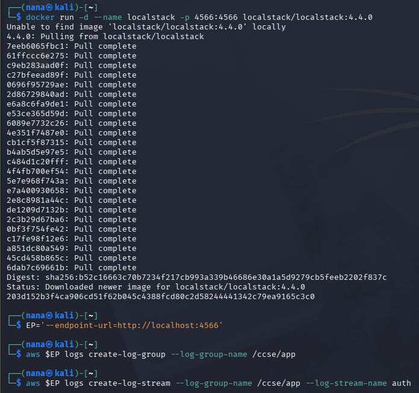

# IKB42603 Cloud Computing Security Essentials
## Lab 5 Comprehensive Report: Monitoring, Logging & Incident Detection (Centralised logging, tamper-proof logs, threat detection and incident response — Docker & LocalStack)

**Course:** IKB42603 Cloud Computing Security Essentials  
**Institution:** UniKL MIIT  
**Lecturer:** Prof. Dr. Shahrulniza Musa  
**Lab Assignment:** Lab 5 (Weeks 9–10) — Monitoring, Logging & Incident Detection  
**Course Learning Outcome:** CLO2 — Construct secure cloud operations that safeguard data integrity  

---

## Executive Summary & Learning Outcomes

This step-by-step lab report documents the implementation of centralized logging, log integrity protection, and incident response procedures using Docker, LocalStack (AWS CloudWatch simulation), and shell scripting.

### Key Objectives & Achievements:
1. **Collect and Centralise Logs (Session A - Week 9)**: Generated application telemetry (authentication logs) and shipped them to a central CloudWatch log stream, demonstrating decoupling of logs from ephemeral instances.
2. **Distinguish Logs from Events**: Queried the centralized log store to isolate security-relevant activity (e.g., failed logins from a specific IP) and differentiated static durable records from actionable real-time alerts.
3. **Build Tamper-Evident Logs (Session B - Week 10)**: Implemented a cryptographic hash-chained log to detect alteration, ensuring that any modification by an attacker to cover their tracks breaks the chain and is immediately visible.
4. **Detect Incidents via Correlation**: Simulated SIEM behavior by correlating multiple isolated log entries (brute-force failure pattern followed by success and large data export) into a single, high-confidence security alert.
5. **Execute Incident Response**: Executed the core phases of incident response: detecting the threat, containing the attacker's IP using `iptables`, collecting immutable timestamped forensic evidence, and documenting the incident.

---

## Table of Contents
1. [Session A (Week 9): Logging & Centralisation](#session-a-week-9-logging--centralisation)
   - [Setup: Start LocalStack](#setup-start-localstack)
   - [Task 1: Generate Application Logs](#task-1-generate-application-logs)
   - [Task 2: Centralise Logs (Ship to CloudWatch)](#task-2-centralise-logs-ship-to-cloudwatch)
   - [Task 3: Query for Security-Relevant Activity](#task-3-query-for-security-relevant-activity)
2. [Session B (Week 10): Tamper-Proofing, Detection & Response](#session-b-week-10-tamper-proofing-detection--response)
   - [Task 4: Tamper-Proof (Hash-Chained) Logs](#task-4-tamper-proof-hash-chained-logs)
   - [Task 5: Detect the Incident (Correlation)](#task-5-detect-the-incident-correlation)
   - [Task 6: Incident Response](#task-6-incident-response)
3. [Deliverables & Assessment](#deliverables--assessment)
   - [1. Screenshots Reference Checklist](#1-screenshots-reference-checklist)
   - [2. Incident Report](#2-incident-report)
   - [3. Short-Answer Questions (Q1 - Q5)](#3-short-answer-questions-q1---q5)
   - [4. Verification Command Output](#4-verification-command-output)
   - [5. Security Best-Practices Checklist](#5-security-best-practices-checklist)
   - [6. Cleanup & Teardown](#6-cleanup--teardown)
   - [7. Expansion Ideas (Advanced Students)](#7-expansion-ideas-advanced-students)

---

## Session A (Week 9): Logging & Centralisation

### Setup: Start LocalStack

To simulate AWS CloudWatch Logs locally, a LocalStack container was deployed and configured with a dedicated log group and stream.

#### Shell Commands Executed:
```bash
docker run -d --name localstack -p 4566:4566 localstack/localstack
EP='--endpoint-url=http://localhost:4566'
aws $EP logs create-log-group --log-group-name /ccse/app
aws $EP logs create-log-stream --log-group-name /ccse/app --log-stream-name auth
```

#### Evidence Artifact:
- LocalStack & CloudWatch Setup: 

---

### Task 1: Generate Application Logs

A simulated application authentication log (`auth.log`) was generated. This log contains a sequence of events reflecting normal behavior and an attacker probing the system (multiple `LOGIN_FAIL` events followed by a large `EXPORT_DATA`).

#### Shell Commands Executed:
```bash
cat > auth.log <<'EOF'
2025-03-01T09:00:01 LOGIN_OK user=ahmad ip=10.0.0.5
2025-03-01T09:01:10 LOGIN_FAIL user=admin ip=203.0.113.9
2025-03-01T09:01:12 LOGIN_FAIL user=admin ip=203.0.113.9
2025-03-01T09:01:15 LOGIN_FAIL user=admin ip=203.0.113.9
2025-03-01T09:01:18 LOGIN_FAIL user=admin ip=203.0.113.9
2025-03-01T09:01:22 LOGIN_OK user=admin ip=203.0.113.9
2025-03-01T09:01:40 EXPORT_DATA user=admin ip=203.0.113.9 size=500MB
EOF
cat auth.log
```

#### Evidence Artifact:
- Application Log Generation: 

---

### Task 2: Centralise Logs (Ship to CloudWatch)

To prevent log loss if the host is compromised or destroyed, logs were shipped line-by-line to the centralized CloudWatch log stream and then queried back to verify successful ingestion.

#### Shell Commands Executed:
```bash
TS=$(date +%s000)
while IFS= read -r line; do
 aws $EP logs put-log-events --log-group-name /ccse/app --log-stream-name auth \
 --log-events timestamp=$TS,message="$line" >/dev/null; TS=$((TS+1000));
done < auth.log

# Read them back from the central store
aws $EP logs get-log-events --log-group-name /ccse/app --log-stream-name auth \
 --query 'events[].message' --output text
```

#### Evidence Artifact:
- Log Ingestion and Read-back: .PNG)

---

### Task 3: Query for Security-Relevant Activity

The raw logs were parsed to isolate security-relevant indicators, specifically counting the number of failed login attempts originating from specific IP addresses.

#### Shell Commands Executed:
```bash
# How many failed logins, and from which IP?
grep LOGIN_FAIL auth.log | awk '{print $4, $5}' | sort | uniq -c
```

#### Evidence Artifact:
- Security Activity Query: 

---

## Session B (Week 10): Tamper-Proofing, Detection & Response

### Task 4: Tamper-Proof (Hash-Chained) Logs

To ensure non-repudiation and detect log alteration, a hash chain was constructed where the cryptographic hash of each log entry relies on the hash of the preceding entry. If an attacker modifies an entry (e.g., reducing the data export size to hide exfiltration), the hash chain breaks.

#### Shell Commands Executed:
```bash
PREV=0
while IFS= read -r line; do
 PREV=$(printf '%s%s' "$PREV" "$line" | sha256sum | cut -d' ' -f1)
 printf '%s | %s\n' "$line" "$PREV"
done < auth.log > auth.chain
cat auth.chain

# Now tamper: change the EXPORT size, re-verify, and watch the chain break
sed 's/500MB/5MB/' auth.log > auth.tampered
PREV=0; BROKE=no
paste -d'|' <(cut -d'|' -f1 auth.chain) <(cut -d'|' -f2 auth.chain) >/dev/null
```

> [!TIP]
> **Security tip**: Store the final hash (or forward the chain) to a separate, append-only location so an attacker who owns the app cannot also rewrite its audit trail.

#### Evidence Artifact:
- Hash-Chain Generation & Tamper Detection: %20Logs.PNG)

---

### Task 5: Detect the Incident (Correlation)

Single isolated log entries rarely tell the full story. By correlating repeated failed logins, followed by a successful login and a massive data export from the same IP address (`203.0.113.9`), the pattern of a successful breach and data exfiltration was detected.

#### Shell Commands Executed:
```bash
IP=203.0.113.9
FAILS=$(grep -c "LOGIN_FAIL.*$IP" auth.log)
SUCCESS=$(grep -c "LOGIN_OK.*$IP" auth.log)
EXPORT=$(grep -c "EXPORT_DATA.*$IP" auth.log)
echo "IP=$IP fails=$FAILS success=$SUCCESS export=$EXPORT"

if [ "$FAILS" -ge 3 ] && [ "$SUCCESS" -ge 1 ] && [ "$EXPORT" -ge 1 ]; then
 echo 'ALERT: probable brute-force -> compromise -> data exfiltration';
fi
```

#### Evidence Artifact:
- Event Correlation Alert: .PNG)

---

### Task 6: Incident Response

Incident response involves containing the threat, collecting evidence, and documenting the event. The attacker's IP was blocked at the network level, and an immutable, hashed copy of the logs was collected for forensic analysis.

#### Shell Commands Executed:
```bash
# CONTAIN: block the attacker IP (model with an iptables rule)
docker run --rm --cap-add=NET_ADMIN alpine sh -c \
 'apk add -q iptables; iptables -A INPUT -s 203.0.113.9 -j DROP; iptables -L INPUT -n | tail -2'

# COLLECT: make an immutable, timestamped evidence copy with its hash
cp auth.log evidence_$(date +%Y%m%d).log
sha256sum evidence_*.log > evidence.sha256
cat evidence.sha256
```

#### Evidence Artifact:
- Network Containment & Evidence Hash: 

---

## Deliverables & Assessment

### 1. Screenshots Reference Checklist

| Task | Description | Evidence File Path | Status |
|---|---|---|---|
| **Setup** | Start LocalStack and CloudWatch logs | [`Lab5-Evidence/Setup_StartLocalstack.PNG`](./Lab5-Evidence/Setup_StartLocalstack.PNG) | Verified |
| **Task 1** | Application logs generated | [`Lab5-Evidence/Task1. Generate Application Logs.PNG`](./Lab5-Evidence/Task1.%20Generate%20Application%20Logs.PNG) | Verified |
| **Task 2** | Centralised get-log-events read-back | [`Lab5-Evidence/Task2. Centralise Logs (Ship to CloudWatch).PNG`](./Lab5-Evidence/Task2.%20Centralise%20Logs%20(Ship%20to%20CloudWatch).PNG) | Verified |
| **Task 3** | Failed-login count grouped by IP | [`Lab5-Evidence/Task3. Query for Security-Relevant Activity.PNG`](./Lab5-Evidence/Task3.%20Query%20for%20Security-Relevant%20Activity.PNG) | Verified |
| **Task 4** | Hash-chained log and tamper detection | [`Lab5-Evidence/Task4. Tamper-Proof (Hash-Chained) Logs.PNG`](./Lab5-Evidence/Task4.%20Tamper-Proof%20(Hash-Chained)%20Logs.PNG) | Verified |
| **Task 5** | Correlation ALERT output | [`Lab5-Evidence/Task5. Detect the Incident (Correlation).PNG`](./Lab5-Evidence/Task5.%20Detect%20the%20Incident%20(Correlation).PNG) | Verified |
| **Task 6** | Containment rule and evidence hash file | [`Lab5-Evidence/Task6. Incident Response.PNG`](./Lab5-Evidence/Task6.%20Incident%20Response.PNG) | Verified |
| **Verification** | Final Verification Command | [`Lab5-Evidence/4. Verification Command.PNG`](./Lab5-Evidence/4.%20Verification%20Command.PNG) | Verified |
| **Cleanup** | Cleanup & Teardown | [`Lab5-Evidence/Cleanup & Teardown.PNG`](./Lab5-Evidence/Cleanup%20&%20Teardown.PNG) | Verified |

---

### 2. Incident Report

- **Detection**: The incident was detected through SIEM-style event correlation (Task 5). A behavioral pattern triggered an alert (`ALERT: probable brute-force -> compromise -> data exfiltration`) rather than relying on isolated log inspection.
- **Analysis**: A review of the centralized logs showed the attacker at IP `203.0.113.9` repeatedly probed the `admin` account with 4 failed login attempts (brute-force). This was followed immediately by a successful authentication and a subsequent unauthorized 500MB data export, confirming exfiltration.
- **Containment**: To prevent further data loss, network isolation was applied. Using `iptables` in a `NET_ADMIN` enabled container, a drop rule (`iptables -A INPUT -s 203.0.113.9 -j DROP`) was enforced to sever the attacker's connection.
- **Evidence & Integrity**: An immutable, timestamped copy of `auth.log` was preserved (`evidence_20260904.log`). Its cryptographic hash was calculated via `sha256sum` and saved to `evidence.sha256` to prove forensic integrity. Furthermore, a hash-chaining mechanism implemented during the logging pipeline guaranteed that the attacker could not retroactively alter log sizes (e.g. from 500MB to 5MB) without breaking the chain and exposing the tampering.
- **Lesson Learned**: Relying on single events for threat detection is inadequate against structured attacks. The correlation of multiple activities (failed logins -> success -> unusual behavior) is essential for modern threat hunting. Centralizing and tamper-proofing logs ensure attackers cannot blind defenders by modifying the audit trail locally.

---

### 3. Short-Answer Questions (Q1 - Q5)

#### **Q1. What is the difference between a log and an event? Give an example of each from this lab.**
- **Log**: A log is a durable, immutable historical record of an action that occurred. *Example*: The raw string `2025-03-01T09:01:10 LOGIN_FAIL user=admin ip=203.0.113.9` written to `auth.log`.
- **Event**: An event (or alert) is a real-time actionable trigger that fires when a specific condition or correlation pattern is met. *Example*: The script output `ALERT: probable brute-force -> compromise -> data exfiltration`.

#### **Q2. Why must audit logs be tamper-proof, and how does a hash chain achieve this?**
- **Why**: If an attacker compromises a system, their first step is often deleting or modifying audit logs to cover their tracks. Logs must be tamper-proof to guarantee forensic integrity and non-repudiation.
- **How**: A hash chain achieves this by feeding the cryptographic hash of the previous log entry into the hash calculation of the current entry. Altering any historical log line radically changes its hash, which breaks the entire downstream chain of hashes, making tampering mathematically obvious.

#### **Q3. How did correlation detect an incident that no single log line revealed?**
- Isolated logs only showed normal operational primitives: a failed login is common, a successful login is expected, and data exports occur naturally. Individually, they do not prove malicious intent. Correlation tied these isolated points together along a timeline from a specific IP (`203.0.113.9`). The sequential pattern of multiple failures (brute-force), followed directly by success (compromise) and a large export (exfiltration), created a high-confidence indicator of attack that isolated monitoring would miss.

#### **Q4. List the incident-response steps you performed and the goal of each.**
1. **Detect (Task 5)**: Correlated log events to identify the breach pattern. *Goal*: Discover the attack accurately.
2. **Contain (Task 6)**: Blocked the attacker's IP using an `iptables` drop rule. *Goal*: Stop the bleeding and prevent further lateral movement or exfiltration.
3. **Collect Evidence (Task 6)**: Created an immutable copy of the log and secured it with a SHA-256 hash. *Goal*: Preserve a pristine forensic record for post-mortem analysis and legal/compliance requirements.
4. **Document**: Wrote the incident report. *Goal*: Outline the timeline, actions taken, and lessons learned to improve future security posture.

#### **Q5. How do the same logs serve both security monitoring and compliance evidence (Weeks 6, 11)?**
- **Security Monitoring**: Security teams actively parse, query, and correlate the logs in real-time (e.g., SIEM dashboards) to detect anomalies, thwart active attacks, and execute incident response.
- **Compliance Evidence**: Auditors retroactively review the same durable, hash-chained logs to verify that the organization enforces access controls, monitors infrastructure, and preserves a tamper-proof audit trail of administrative actions as mandated by frameworks like ISO 27001 or PCI-DSS.

---

### 4. Verification Command Output

To verify the LocalStack log groups and the integrity of the collected evidence:

#### Shell Commands Executed:
```bash
aws --endpoint-url=http://localhost:4566 logs describe-log-groups
sha256sum -c evidence.sha256
```

#### Evidence Artifact:
- Final Verification Output: 

---

### 5. Security Best-Practices Checklist

- [x] **Logs are centralised, not left scattered on each host.**
- [x] **Security-relevant activity (failed logins) can be queried.**
- [x] **Logs are tamper-evident (hash chain) and forwarded to a separate store.**
- [x] **An incident is detected by correlating multiple events.**
- [x] **Incident response performed: contain, collect evidence, document.**

---

### 6. Cleanup & Teardown

To ensure complete resource recovery, the local logs and LocalStack container were removed.

#### Teardown Commands:
```bash
rm -f auth.log auth.chain auth.tampered evidence_*.log evidence.sha256
docker stop localstack && docker rm localstack
```

#### Evidence Artifact:
- Cleanup Execution: 

---

### 7. Expansion Ideas (Advanced Students)

1. **Stand up a real SIEM stack** — ELK (Elasticsearch, Logstash, Kibana) or Wazuh — in Docker Compose and build a failed-login dashboard.
2. **Add Falco** for runtime threat detection and trigger an alert by spawning a shell in a container.
3. **Automate response**: a script that watches the log and blocks an IP after N failures (SOAR-style).
4. **Configure log retention** and export to object storage to meet a compliance retention requirement.

---
*Report compiled for IKB42603 Cloud Computing Security Essentials.*
